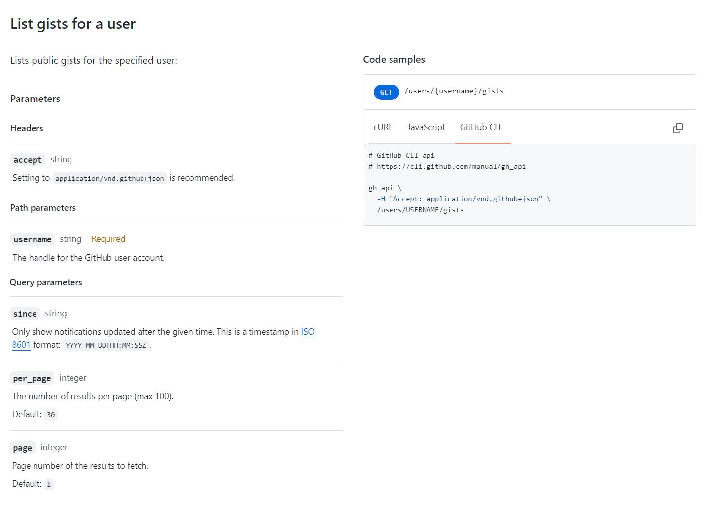
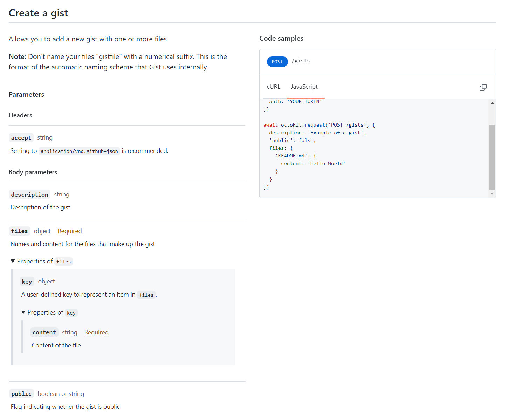

# Gist API 사용하기

## Gist 란 ?

코드, 메모, 이슈 등을 기록 또는 공유하는 목적으로 사용할 수 있는 무료 서비스. Tistory 등 다른 블로그에서 Github 용으로 코드 블럭 처리 된것들이 모두 Gist 이다. Gist API 를 활용해서 작성, 수정 등의 작업을 할 것이다.

## Octokit

Github 는 개발자들을 위한 공간이라 API 문서도 잘 정리되어 있다.

- [Github API Docs](https://docs.github.com/ko/rest?apiVersion=2022-11-28)

사실 API 를 사용하기 위해서는 API 가 제공하는 요청 형식, 응답 형식 등을 살펴본 뒤 프로그램 안에서 직접 요청/응답을 처리 해야한다. 실제 주고 받는 데이터를 보기 위해서는 WireShark 같은 도구들을 이용해야 하는데, 다행이도 깃헙은 Octokit 이라는 API Wrapper 를 직접 개발하고 관리한다.  

- [참고] API Wrapper : API 와 상호 작용하는 프로세스를 단순화 해주는 것. 특정 프로그래밍 언어 또는 인터페이스를 통해 API 를 엑세스 하는 방법을 제공하여 API 호출 프로세스를 간소화 하는 데 도움이 된다. ([참고사이트](https://guides.lib.utexas.edu/c.php?g=897091&p=6453521))

__근데 이건 굳이 필요 없다!__ 우린 공부할 것이므로, axios 요청을 통해서만 구현을 할 것이다. 기능 별 주소는 API Docs 의 기능 상단에 작성되어 있다.

- [Gists API Docs](https://docs.github.com/ko/rest/gists/gists?apiVersion=2022-11-28)

---

### Gist API 기본 사용법

```
* 주의 사항
인증이 안된 요청은 시간당 60회 제한이 걸려있다.
요청에 인증이 필요 없어도, Personal access token 을 추가하여 요청하면 시간당 5,000회 까지 가능하다.
```

#### 1. 특정 유저의 Gist List 가져오기



</br>

생성 시 List 를 가져오도록 Vue 코드 작성

```javascript
created() {
  const API_URL = `https://api.github.com/users/${username}/gists`

  axios.get(API_URL, {
    headers: { 
      Authorization: process.env.VUE_APP_GITHUB_TOKEN 
    } 
  })
  .then((res) => {
    // res.data 에 유저가 작성한 리스트가 담겨있다.
    console.log(res.data)
  }).catch((err) => {
    console.log(`err = ${err}`)
  })
}
```

---

#### 2. Gist 글 생성



</br>

Submit 버튼 클릭 시 POST 요청

```javascript
onSubmit(event) {
  event.preventDefault()

  const context = {
    "description": "Test Description",
    "public": false,
    "files": {
      [this.form.title]: {
        "content": `${this.form.content}`
      }
    }
  }

  // 요청 헤더에 Token 정보 설정
  // Token 정보는 .env 파일에 작성
  const headers = {
      Authorization: process.env.VUE_APP_GITHUB_TOKEN,
  }

  axios.post(API_URL, context, { 
    headers: headers 
  })
  .then((res) => {
    console.log(res)
    alert('생성이 완료되었습니다 !')
    // 생성 후 리스트를 보는 페이지로 이동
    this.$router.push({ name: 'gistList' })
  }).catch((err) => {
    console.log(`err = ${err}`)
  })
},
```

---